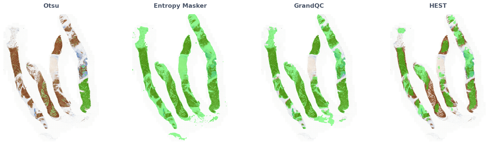

# segmenteer

<small> ___Currently under development.___ </small>

Supported: dicom, tiff image formats; geojson mask output format; unsupervised benchmarking; deep learning models (GrandQC, HEST), classical image segmentation methods, entropy masking segmentation.

